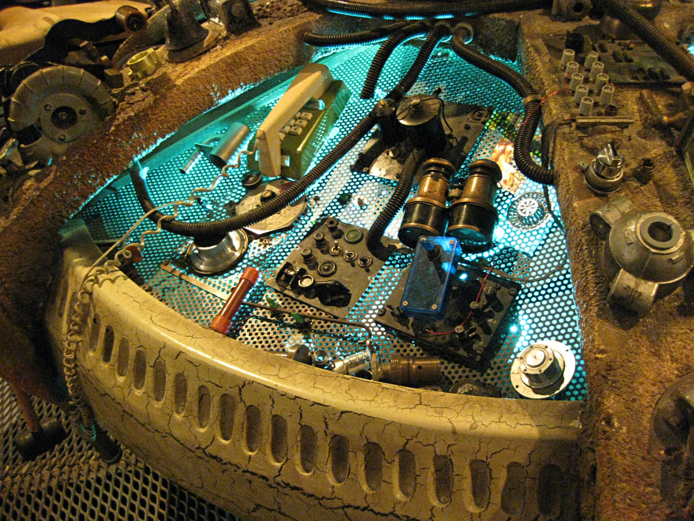

# TARDIS-Pi
Full size TARDIS SFX automation for RPI.  Tested with Pi Model 3B and 3B+.

See http://triangletardis.net for photos and videos.

Pi Setup
---
* 00_pi/00install.txt

Config
---
* console_config.json
* logging.ini

IP Phone
---
If you want a working phone scripts are included to setup an OBIHAI or other device using the Pi as an ethernet gateway.

* 00_pi/wifi-to-eth-route.sh
* 00_pi/iptables.rules  

TODO
---
* Stop a running effect
* Better key mapping/joystick support?
* Fix focus in calibration GUI
* Integration with IP Phone (effects on incomning call, etc.)

Useful Links
---
* https://github.com/arpitjindal97/raspbian-recipes/blob/master/wifi-to-eth-route.sh
* https://github.com/kgbplus/gpiotest

