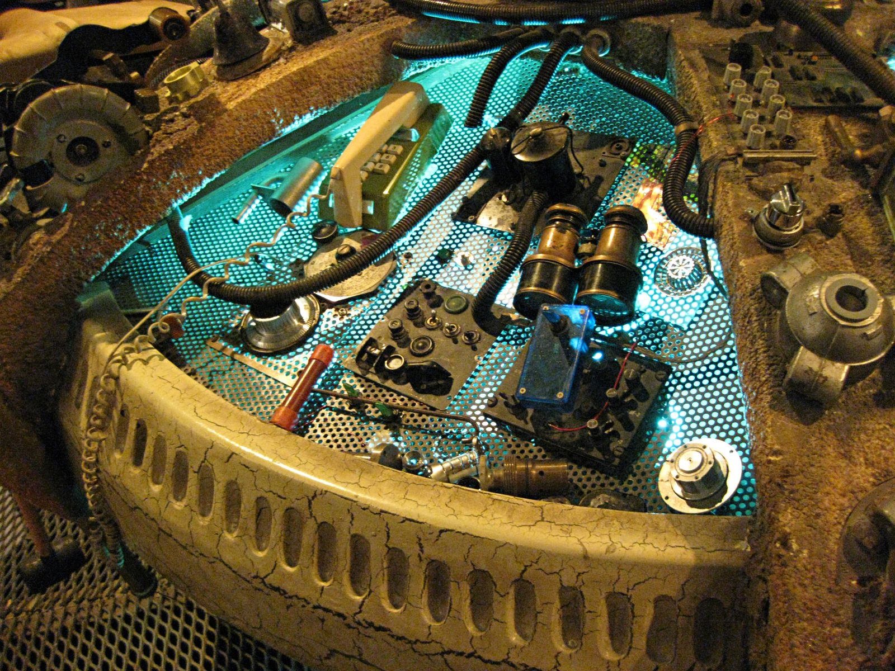

# TARDIS-Pi
Full size TARDIS SFX automation for RPI.  Tested with Pi Model 3B and 3B+.

See http://triangletardis.net for photos and videos.

Pi Setup
---
* 00_pi/00install.txt
* 00_pi/00install.sh

Config
---
* logging.ini
* console_config.json

IP Phone
---
If you want a working phone, scripts are included to setup an OBIHAI or other device using the Pi as an ethernet gateway.

* 00_pi/masq

TODO
---
* https://github.com/TriangleTARDIS/TARDIS-Pi/issues

Useful Links
---
* https://github.com/arpitjindal97/raspbian-recipes/blob/master/wifi-to-eth-route.sh
* https://github.com/kgbplus/gpiotest
* https://github.com/alwye/get_throttled/blob/master/get_throttled.sh
* http://basecase.org/env/on-rainbows
* https://www.asciiart.eu
* https://stackoverflow.com/questions/2685435/cooler-ascii-spinners

